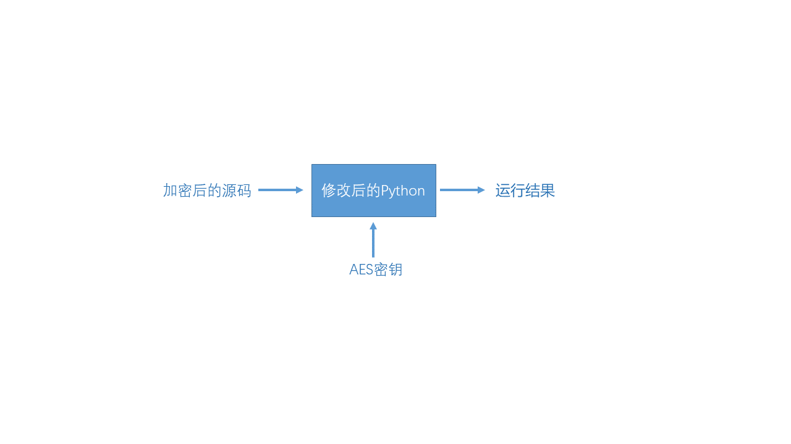

# RAYENCRY

`rayencry`使用AES算法对指定目录中的Python源码加密。

## 内容

- [背景](#背景)
- [安装](#安装)
- [使用说明](#使用说明)
- [修改Python源码（`仅针对Python-2.7.15`）](#修改Python源码)
- [Contributor](#Contributor)
- [Reference](#Reference) 

## 背景

由于Python为解释形语言，源码直接暴漏在生产环境中，为了防止Python源码泄露造成不必要安全问题，可以改造Python解释器用于执行加密后的python代码。



## 安装

### 1. 目录结构

目录 | 描述
-- | --
[doc](../doc) | 文档
[src](../src) | 源码
[configure.json](../configure.json) | 配置文件例子
[install.sh](../install.sh) | 安装脚本
[uninstall.sh](../uninstall.sh) | 卸载脚本
[Makefile](../Makefile) | Makefile

### 2. 编译依赖

rayencry依赖`libssl`库，使用如下两种方法安装`libssl`均可: 
- `apt install libssl-dev`
- 源码编译安装libssl

### 3. 编译安装

- 修改`decrypt_file.c`中的AES密匙和AES的cbc向量。注意：均为128位。
- 使用`sudo make`编译
- 使用`sudo make install`或者运行脚本`install.sh`安装
- 使用`sudo make uninstall`或者运行脚本`uninstall.sh`卸载
- 使用`sudo make clean`清除编译结果


## 使用说明

### 1. 配置`configure.json`文件：

```json
{
    "select":"/home/src",
    "except":[
        "except_file.py",
        "except_directory"
    ],
    "archive":"/home/src_en"
}
```
属性      | 必要性 |   类型  |               描述
----      | ----  |  ----   |              ----
`select`  | 必选  | `string` | 需要加密的源码`目录`（只能是目录）。请使用绝对地址。
`except`  | 可选  | `array`  | 需要在加密文件中排除的`目录`或者`路径`。请使用相对地址。
`archive` | 必选  | `string` | 解密`目录`名字。请使用绝对地址。

### 2. 使用rayencry加密源码目录

```shell
rayencry <config file>
```

## 修改Python源码（`仅针对Python-2.7.15`）
下载Python-2.7.15解释器的源码并对其进行如下的修改以运行加密的Python源码：
> 推荐使用[aliyun镜像](https://npm.taobao.org/mirrors/python/)下载python源码

### 1. 添加文件
复制文件`./src/Python/decrypt_file_acs.c`到`Python-2.7.15/Python`中  
复制文件`./src/Include/decrypt——fileacs.h`到`Python-2.7.15/Python`中

### 2. 添加解密函数到Python源码中
```diff

Module/main.c
------------

...
- 609            if ((fp = fopen(filename, "r")) == NULL) {
+ 609            if ((fp = d_open(filename, "r")) == NULL) {
...

Python/import.c
------------

...
-1579            fp = fopen(buf, filemode);
+1579            fp = d_open(buf, filemode);
...

```

### 3. 禁止生成`.pyc`文件

由于开发者可以通过`.pyc`反编译出python源代码，所以需要禁用生成`.pyc`文件
```diff
Module/main.c
------------

...
+ 445 Py_DontWriteBytecodeFlag++;
...

Python/pythonrun.c
------------

...
- 194 if ((p = Py_GETENV("PYTHONDONTWRITEBYTECODE")) && *p != '\0')
- 195     Py_DontWriteBytecodeFlag = add_flag(Py_DontWriteBytecodeFlag, p);
...

```

### 4. 禁止访问字节码

```diff
./Objects/codeobject.c
------------

...
- 205     {"co_code",         T_OBJECT,       OFF(co_code),           READONLY},
...

```

### 5. 修改Makefile.in.pre

Makefile需要链接`libssl`库，生成`decrypt_source_file.o`

```diff
./Makefile.pre.in
------------

... 
- 188 SYSLIBS=	$(LIBM) $(LIBC)
+ 188 SYSLIBS=	$(LIBM) $(LIBC) -lcrypto -lssl
... 
295 ##########################################################################
296 PYTHON_OBJS=	\
+ 297	Python/decrypt_source_file.o \
298		Python/_warnings.o \
299		Python/Python-ast.o \
... 
752 ############################################################################
753 # Header files
754
755 PYTHON_HEADERS= \
+ 756 		Include/decrypt_source_file.h \
757 		Include/Python-ast.h \
758 		Include/Python.h \
759 		Include/abstract.h \
...

```

### 6. 编译安装Python

```
sudo ./configure --prefix=$PREFIX
sudo make
sudo make install
```


## Contributor

万炳江[@echoechoin](https://github.com/echoechoin)  
> Email: admin@study644.top  
> QQ: 614699596

## Reference

[[1] 如何保护你的 Python 代码](https://zhuanlan.zhihu.com/p/54296517)  
[[2] Python 2.7.18 documentation](https://docs.python.org/2.7/)