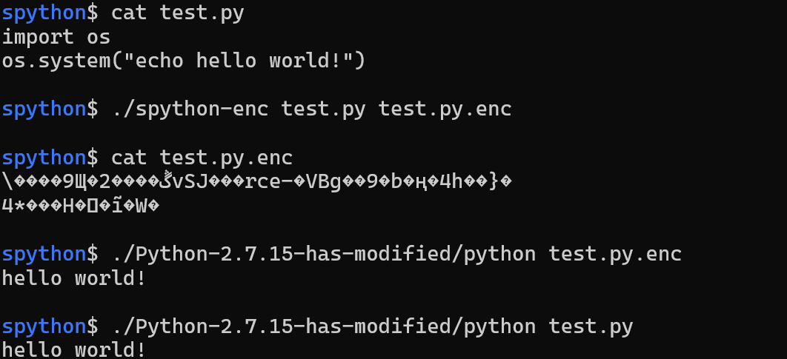

# SPYTHON

## Python2.7.15

[readme.md](./Python-2.7.15/readme.md)

## Python3.7.3

[readme.md](./Python-3.7.3/readme.md)

## Contributor

[@echoechoin](https://github.com/echoechoin)   
> QQ: 614699596

## Reference

[[1] 如何保护你的 Python 代码](https://zhuanlan.zhihu.com/p/54296517)  
[[2] Python 2.7.18 documentation](https://docs.python.org/2.7/)

have fun！🤣🤣🤣🤣🤣🤣
